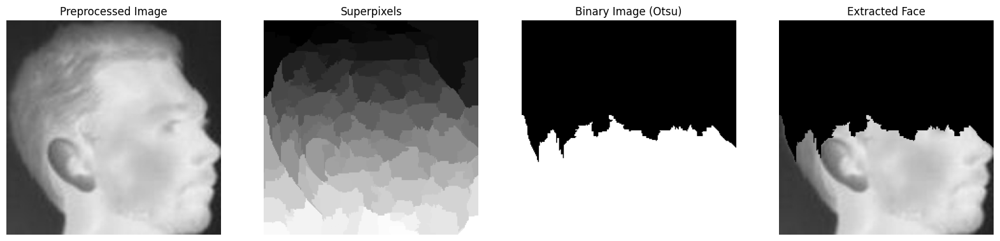

# Th-VGG16: A Thermal Face Feature Extraction Model (Finetuned VGG-16 + SuperPixel)

<p align="center">
  
  <br>
  <em>First-hand Superpixel technique face extraction implementation result</em>
</p>

## Introduction

Th-VGG16 is as a result of the fine-tuning of the VGG16 model using transfer learning techniques for the thermal image dataset from the Terravic Thermal Image Dataset [Terravic Facial IR Database](http://vcipl-okstate.org/pbvs/bench/Data/04/download.html) to train and validate the enhanced feature extraction capabilities. It incorporates the fine-tuning and the superpixel technique as described in the research paper [Human Thermal Face Extraction Based on SuperPixel Technique](https://www.researchgate.net/publication/283724229_Human_Thermal_Face_Extraction_Based_on_SuperPixel_Technique) to extract face feature embeddings from thermal image data and compare recognition rates with new images. This project implements a combination of center and contrastive loss functions to build the model.

**Key enhancements include:**

- Implementation of Quick-Shift and Otsu's thresholding methods to improve segmentation and feature extraction.

- Use of combined center loss and contrastive loss functions to enhance the discriminative power of the feature embeddings.

---

## Table of Contents

1. [Installation](#installation)
2. [Usage](#usage)
3. [Dataset](#dataset)
4. [Methodology](#methodology)
5. [Experiments and Results](#experiments-and-results)
6. [Contributing](#contributing)
7. [License](#license)
8. [Acknowledgments](#acknowledgements)

---

## Installation

### basic prerequisites

- Python 3.x
- TensorFlow
- Keras
- OpenCV
- NumPy
- Matplotlib
- Scikit-learn
- Jupyter Notebook

### set up

Clone the repository:

```bash
git clone https://github.com/neyedhayo/thermal-face-feature-extraction-model.git

# Navigate to the project directory
cd thermal-face-feature-extraction-model

# Install required Python packages
pip install -r requirements.txt
```

## Usage

### Running the Notebooks

- **Preprocessing**: Run the `preprocessing.py` script to prepare the data for training.
- **Model Training**: Use the `finetunedVGG16_+_superpixel_embeddingfeatures.ipynb` notebook to train the VGG16 model with the thermal images.
- **Superpixel Technique**: Execute the `superpixel.ipynb` notebook to apply the superpixel technique.
- **Testing**: The `embedding_extraction_test.ipynb` notebook contains the evaluation and testing steps.

## Dataset

The project uses the Terravic Thermal Image Dataset which contains thermal images of human faces. The dataset can be downloaded from [Terravic Facial IR Database](https://ieee-dataport.org/open-access/terravic-facial-ir-database).

## Methodology

### 1.1. Finetuning VGG16 with Transfer Learning

The proposed method finetunes the VGG16 architecture by discarding the last 9 layers and retaining the first 10 layers and by adding custom layers to the base model, of which only the last 3 are trained. The process involves:

- Using a max-pooling layer after the 10th layer.
- Applying batch-normalization.
- Adding a softmax classifier.

The training steps include:

- **Loading Pre-trained VGG16**: Without the top layers.
- **Adding Custom Layers**: Including GlobalAveragePooling, Dense, and Dropout layers.
- **Compilation**: Using the Adam optimizer and loss functions (center and contrastive loss).
- **Training**: On the preprocessed thermal images.

### 1.2. Superpixel Technique

The superpixel technique used in this project is based on the Quick-Shift method, which helps in segmenting the image into meaningful regions, reducing computational complexity.

- Parameter Tuning: Adjusting ratio, kernel size, and maximum distance.

- Superpixel Generation: Using the Quick-Shift algorithm.
Thresholding: Applying Otsu's thresholding to convert superpixels into binary images.

- For more technical details, refer to the paper: [Human Thermal Face Extraction Based on SuperPixel Technique](https://www.researchgate.net/publication/283724229_Human_Thermal_Face_Extraction_Based_on_SuperPixel_Technique).

### 1.3. Loss Functions

The model combines center loss and contrastive loss to improve the discriminative ability of the feature embeddings, which are crucial for accurate face recognition.

## Experiments and Results

The project tested the model under various challenging conditions using the Terravic Facial IR Database, achieving promising results with high recognition rates even under occlusions like glasses and hats. Details of the experimental setup and results can be found in the corresponding Jupyter notebooks in the repository.

## Contributing

Contributions to this project are welcome. Please fork the repository and submit pull requests with your features or fixes.

1. Fork it ([https://github.com/neyedhayo/thermal-face-feature-extraction-model/fork](https://github.com/neyedhayo/thermal-face-feature-extraction-model/fork))
2. Create your feature branch (`git checkout -b feature/fooBar`)
3. Commit your changes (`git commit -am 'Add some fooBar'`)
4. Push to the branch (`git push origin feature/fooBar`)
5. Create a new Pull Request

## License

Distributed under the Apache-2.0 License. See `LICENSE` for more information.

## Acknowledgements

- The Terravic Facial IR Database is part of the OTCBVS Benchmark Dataset Collection.
- The VGG16 model used in this project is based on the architecture presented in the paper [Very Deep Convolutional Networks for Large-Scale Image Recognition](https://arxiv.org/abs/1409.1556).
- Inspired by the research on superpixel techniques and their application in thermal image processing.
- [raguilar-f/Thermal-Face-Recognition-Using-Convolutional-Neural-Networks-and-Transfer-Learning](https://github.com/raguilar-f/Thermal-Face-Recognition-Using-Convolutional-Neural-Networks-and-Transfer-Learning) for the detailed methodology on using VGG16 and transfer learning.
